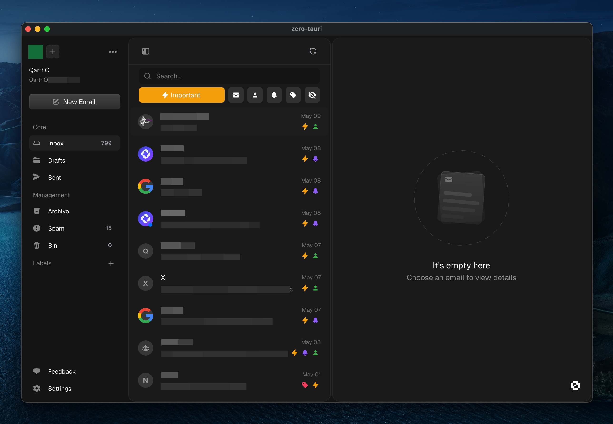

# Zero Tauri


> [!IMPORTANT]
> **Disclaimer**: This project is not affiliated with, endorsed by, or connected to Zero or Mail-0 in any way

<div align="center">


A Tauri-based desktop app for Zero, the privacy-first email client.

[Website](https://0.email) • [GitHub](https://github.com/Mail-0/Zero) • [Discord](https://discord.gg/0email)



</div>

## 🚀 About

This is an unofficial desktop application wrapper for Zero, built using Tauri. Zero is a privacy-first email client that puts your security and privacy first.

> [!NOTE]
> Currently this is a simple webview wrapper for the Zero website. Future versions may include deeper native integration.

> [!WARNING]
> **Do not be impressed**. This is just a single line in the tauri config 😂

## 🛠️ Prerequisites

Before you begin, ensure you have the following installed:
- [Rust](https://www.rust-lang.org/tools/install)
- [Cargo](https://doc.rust-lang.org/cargo/getting-started/installation.html)
- [Bun](https://bun.sh)

## 🚀 Getting Started

1. **Clone the repository**
   ```bash
   git clone https://github.com/quartzdevgg/zero-tauri.git
   cd zero-tauri
   ```

2. **Install dependencies**
   ```bash
   bun install
   ```

3. **Build the application**
   ```bash
   bun run tauri build
   ```

## 🤝 Contributing

Contributions are welcome! Feel free to open issues and submit pull requests.

## 📝 License

This project is licensed under the MIT License - see the [LICENSE](LICENSE) file for details.

## 🙏 Acknowledgments

- [Zero](https://0.email) - The amazing email client this wrapper is built for
- [Tauri](https://tauri.app) - The framework that makes this possible 